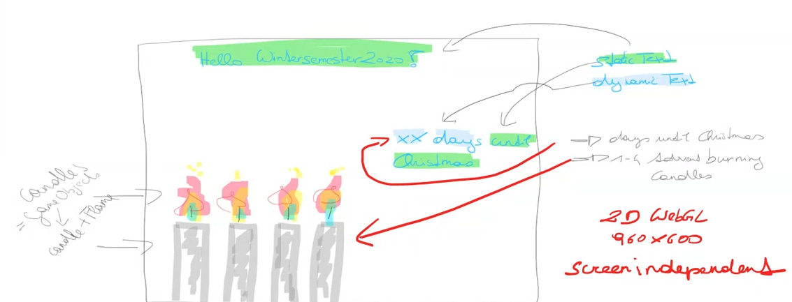

# Adventkranz

### Project description: 
A recap Project where we will create a little countdown until christmas with a visual advent wreath.

### Development platform: 
* Windows 10
* Unity: 2020.1.5f1
* Visual Studio 2019

### Target platform: 
* 2d WebGL (960 x 600) 

### Visuals: 

### Necessary setup/execution steps: 
none

### Third party material: 
* Template2D-Unity202015f1

### Project state: 
incl. progress in percent

### Limitations: 
NO

### Lessons Learned:
* Unity UI Building
* Github Revision

* Scriptable Objects  
What is a SC? = A Scriptable Object is a data container able to save a large amount of data in a convienient way.  
Why do we use a SC? = With using a SC or Scriptable Object we can avoid dublicated data. We can create it and reference to it from multible objects.  
How do you create a SC? =  You have to create a script which inherits from ScriptableObject class insted of MonoBehaviour. 

Copyright by Kilian
